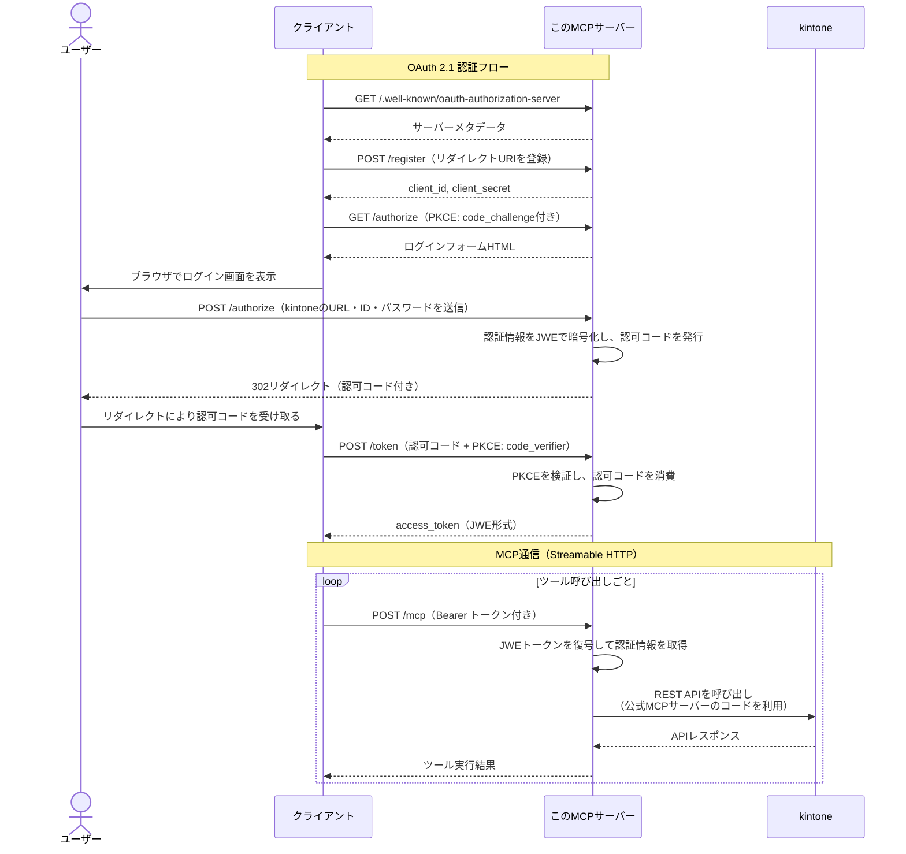

# kintone MCP Server (Remote Ver)

[kintone公式MCPサーバー](https://github.com/kintone/mcp-server)をリモートで動かせるようにラップした[MCP (Model Context Protocol)](https://modelcontextprotocol.io/)サーバーです。

**主な機能**

- 公式MCPサーバーの全機能をそのまま利用できます。
- ローカルではなくサーバー上で動かすので、大人数で利用するのに便利です。
- 各利用者が自分のアカウントでログインして利用できます。

**未対応の機能**

- 2要素認証、APIトークン、Basic認証、クライアント証明書、などには対応していません。ID+パスワード認証でのみ利用できます。
- 添付ファイルのダウンロードには対応していません。

## 使い方

### サーバーを起動する

#### 環境変数

| 変数名 | 必須 | 説明 |
|--------|------|------|
| `JWE_SECRET_KEY` | はい | トークン暗号化用の秘密鍵（base64エンコードされた32バイト） |
| `PORT` | いいえ | 待ち受けポート番号（デフォルト: `3000`） |
| `LOG_LEVEL` | いいえ | ログレベル: `error`, `warn`, `info`, `debug`（デフォルト: `info`） |
| `ALLOW_HTTP_REDIRECT` | いいえ | `true` にすると、非localhostの `redirect_uri` でHTTPを許可する（デフォルト: `false`） |

秘密鍵は以下のコマンドで生成できます。

```bash
openssl rand -base64 32
```

#### Node.jsを使う場合

Node.js 22以上が必要です。

```bash
git clone https://github.com/macrat/remote-kintone-mcp-server.git
cd remote-kintone-mcp-server
npm install
npm run build
JWE_SECRET_KEY="生成した秘密鍵" npm start
```

開発時は `npm run dev` でファイル変更時に自動リロードされます。
この場合、`.env` ファイルに環境変数を記述しておくと便利です。

#### Dockerを使う場合

```bash
docker run -p 3000:3000 -e JWE_SECRET_KEY="生成した秘密鍵" ghcr.io/macrat/remote-kintone-mcp-server
```

#### HTTPSについて

ログイン情報がネットワーク上を流れるため、リバースプロキシ等でHTTPSを設定することを強く推奨します。

### クライアントを設定する

#### Claude Desktopの場合

設定ファイル `claude_desktop_config.json` に以下を追加します。

| OS | パス |
|----|------|
| macOS | `~/Library/Application Support/Claude/claude_desktop_config.json` |
| Windows | `%APPDATA%\Claude\claude_desktop_config.json` |
| Linux | `~/.config/Claude/claude_desktop_config.json` |

```json
{
    "mcpServers": {
        "kintone": {
            "type": "url",
            "url": "https://your-server-address:3000/mcp"
        }
    }
}
```

#### Claude Codeの場合

以下のコマンドで設定できます。

```bash
claude mcp add --transport http kintone https://your-server-address:3000/mcp
```

`--scope` オプションで設定の保存先を変更できます。

| スコープ | 説明 |
|---------|------|
| `local` | 現在のプロジェクトのみで利用（デフォルト） |
| `project` | `.mcp.json` に保存され、チームで共有できる |
| `user` | 全プロジェクトで利用できる個人設定 |

設定ファイルに直接書く場合は、プロジェクトルートの `.mcp.json` に以下のように記述します。

```json
{
    "mcpServers": {
        "kintone": {
            "type": "http",
            "url": "https://your-server-address:3000/mcp"
        }
    }
}
```

#### 初回接続時の認証

初回接続時にブラウザが開き、ログイン画面が表示されます。
kintone環境のURL・ログインID・パスワードを入力すると認証が完了し、MCPサーバーが利用可能になります。
認証トークンの有効期限は24時間です。期限が切れた場合は再度ログインが必要です。

## 仕組み

このMCPサーバーは、Streamable HTTP方式のリモートMCPサーバーとして動作します。
内部では[公式MCPサーバー](https://github.com/kintone/mcp-server)のツール実装をライブラリとして利用し、kintone REST APIを呼び出しています。

ログイン情報の取得にはOAuth 2.1準拠の認証フローを実装しており、ユーザー本人にブラウザ上で入力してもらいます。
入力されたログイン情報はJWE形式で暗号化され、アクセストークンとしてクライアントに渡されます。
MCPリクエストを受け取ると、トークンを復号してログイン情報を取り出し、kintone APIへのリクエストに使用します。



暗号化されてはいますが、ログインID/パスワードがMCPクライアントに保存されることに注意してください。
信頼しているクライアントでのみ利用することをおすすめします。
