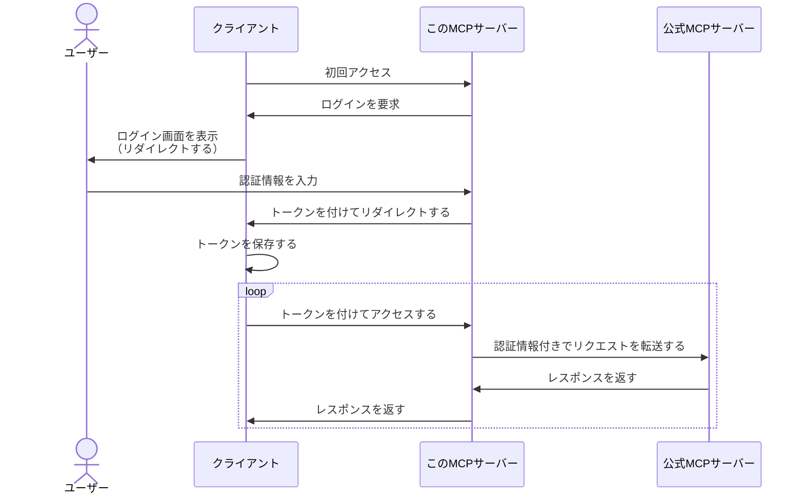

# kintone MCP Server (Remote Ver)

[kintone公式MCPサーバー](https://github.com/kintone/mcp-server)をリモートで動かせるようにラップしたMCPサーバーです。

**主な機能**

- 公式MCPサーバーの全機能をそのまま利用できます。
- ローカルではなくサーバー上で動かすので、大人数で利用するのに便利です。
- 各利用者が自分のアカウントでログインして利用できます。

**未対応の機能**

- 2要素認証、APIトークン、Basic認証、クライアント証明書、などには対応していません。ID+パスワード認証でのみ利用できます。
- 添付ファイルのダウンロードには対応していません。

# 使い方

## サーバーを起動する

ToDo: ここに起動方法を書く。コマンドは以下のようなイメージ。

```bash
# Node.jsを使う場合
git clone https://github.com/macrat/remote-kintone-mcp-server.git
cd remote-kintone-mcp-server
npm install
npm start

# Dockerを使う場合
docker run -p 3000:3000 -e JWE_SECRET_KEY="your-secret-key" ghcr.io/macrat/remote-kintone-mcp-server
```

※ HTTPSの設定を強く推奨します。

## クライアントを設定する

ToDo: ここにClaude DesktopやClaude Codeの場合の設定例を書く。

```json
{
    "mcpServers": {
        "kintone": {
            "url": "https://your-server-address:3000/mcp"
        }
    }
}
```

# 仕組み

このMCPサーバーは、Streamable HTTP方式のMCPサーバーとして起動し、受け取ったリクエストを公式MCPサーバーのコードに転送しています。
このとき必要になるログイン情報は、OAuth風の認証フローを実装して、ユーザー本人に入力してもらっています。
入力してもらったログイン情報はJWE形式で暗号化されてトークンとして利用されます。
MCPサーバーは受け取ったトークンを復号してログイン情報を取得し、公式MCPサーバーへ伝える仕組みになっています。
このようにすることで、ユーザーは自分のアカウントでログインしてMCPサーバーを利用できます。



暗号化されてはいますが、ログインID/パスワードがMCPクライアントに保存されることに注意してください。
信頼しているクライアントでのみ利用することをおすすめします。
