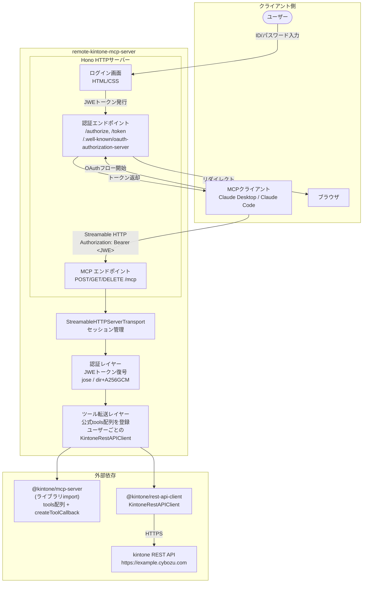
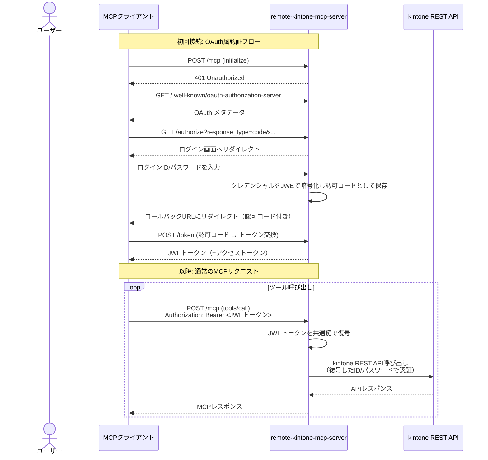

# アーキテクチャ概要

## 全体構成



## リクエストフロー



## コンポーネント構成

### 1. HTTPサーバー（Hono）

- Streamable HTTP方式のMCPエンドポイント (`POST/GET/DELETE /mcp`)
- OAuth風の認証エンドポイント（ログイン画面、トークン発行）
- ログイン画面の提供

### 2. MCP Streamable HTTP トランスポート

- `@modelcontextprotocol/sdk` の `StreamableHTTPServerTransport` を使用
- セッション管理（`Mcp-Session-Id` ヘッダー）
- JSON-RPC 2.0 over HTTP/SSE

### 3. 認証レイヤー

- OAuth 2.1フローに準拠した認証（MCP仕様に基づく）
- JWE（JSON Web Encryption）によるクレデンシャルの暗号化
- `jose` ライブラリで共通鍵暗号（dir + A256GCM）

### 4. ツール転送レイヤー

- 公式MCPサーバーの `tools` 配列を直接import
- ユーザーごとに `KintoneRestAPIClient` を生成
- `createToolCallback` でツールとクライアントを紐付け

## 技術スタック

| 要素 | 選定技術 | 理由 |
|------|---------|------|
| 言語 | TypeScript | MCP SDK との相性、型安全性 |
| HTTPフレームワーク | Hono | 軽量・高速、TypeScriptファースト |
| MCPプロトコル | `@modelcontextprotocol/sdk` | 公式SDK |
| kintone連携 | `@kintone/mcp-server` (ライブラリimport) | 公式ツール定義を直接再利用 |
| kintone APIクライアント | `@kintone/rest-api-client` | 公式SDKから依存として利用 |
| JWE暗号化 | `jose` | TypeScript製、ゼロ依存、JWEフルサポート |
| ランタイム | Node.js >= 22 | kintone公式MCPサーバーの要件に合わせる |

> **設計判断: Hono vs Express**
>
> MCP SDKのサンプルはすべてExpressだが、TypeScriptの型安全性を最大限活用するためHonoを採用した。
> `StreamableHTTPServerTransport.handleRequest()` はNode.jsの `IncomingMessage`/`ServerResponse` を
> 期待するが、`@hono/node-server` の `c.env.incoming`/`c.env.outgoing` 経由でアクセスできることを
> プロトタイプで検証済み（SSEストリーミング含む）。

## ディレクトリ構成（予定）

```
remote-kintone-mcp-server/
├── src/
│   ├── index.ts              # エントリーポイント
│   ├── server/
│   │   ├── mcp.ts            # MCPサーバー・トランスポート設定
│   │   └── http.ts           # Hono HTTPサーバー
│   ├── auth/
│   │   ├── oauth.ts          # OAuth風認証フロー
│   │   ├── jwe.ts            # JWEトークンの暗号化・復号
│   │   └── login.ts          # ログイン画面HTML
│   └── kintone/
│       ├── tools.ts          # 公式ツールの登録・転送
│       └── client.ts         # KintoneRestAPIClient生成
├── docs/                     # 設計ドキュメント
├── package.json
├── tsconfig.json
└── Dockerfile
```
