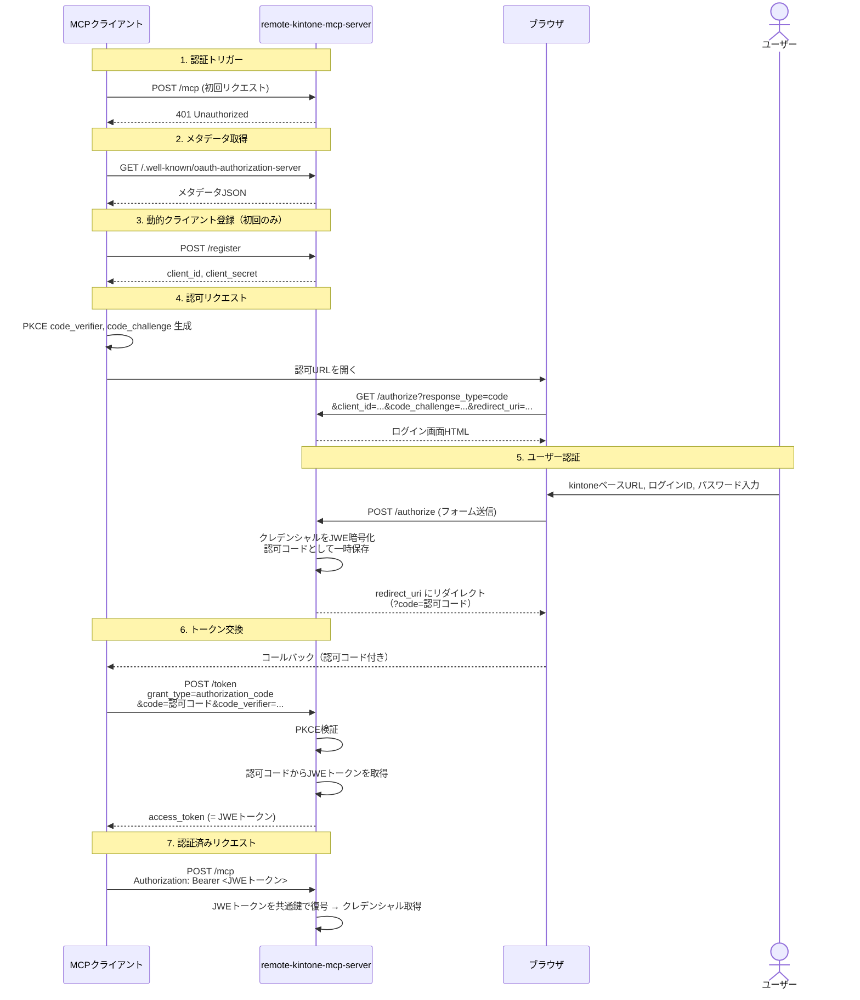

# 認証フローの設計

## 概要

MCP仕様の OAuth 2.1 認証フローに準拠しつつ、トークンの実体として
JWE（JSON Web Encryption）で暗号化されたkintoneクレデンシャルを使用する。

> **設計判断: JWEトークン（クライアント側保存） vs サーバー側セッションストア**
>
> サーバー側セッションストア方式（トークンはランダムIDのみ、パスワードはサーバー側DB保持）も
> 検討した。セキュリティ面ではセッションストア方式が優れるが、追加インフラ（Redis, SQLite等）が
> 必要でデプロイが複雑になる。手軽に使えること（1コマンドで起動）を最優先とし、JWEトークン方式を
> 採用した。トークンの有効期限（`exp`）と鍵ローテーションでリスクを軽減する。
> 将来的にセキュリティ要件が厳しくなった場合はサーバー側セッションストアへの移行を検討する。

## JWE（JSON Web Encryption）

### 使用ライブラリ

- **`jose`** — TypeScript製、ゼロ依存のJOSE実装
- npm: `npm install jose`

### アルゴリズム

| パラメータ | 値 | 説明 |
|-----------|---|------|
| `alg`（鍵管理） | `dir` | 共通鍵を直接コンテンツ暗号鍵として使用 |
| `enc`（コンテンツ暗号化） | `A256GCM` | AES-256-GCMでペイロードを暗号化 |

共通鍵暗号（`dir` + `A256GCM`）を選定した理由:
- 暗号化も復号もサーバー側で行うため、公開鍵暗号のメリットがない
- 鍵が1つで済み、管理がシンプル
- トークンサイズが小さい（RSA暗号化のオーバーヘッドがない）
- `jose` ライブラリでの実装が簡潔

### 共通鍵の生成

サーバー起動時に使用する共通鍵は、事前に生成しておく。

```bash
# OpenSSLで生成する場合（256bit = 32バイトのランダムバイト列）
openssl rand -base64 32
```

```typescript
// jose で生成する場合
import { generateSecret, exportJWK } from "jose";

const secretKey = await generateSecret("A256GCM");
const jwk = await exportJWK(secretKey);
// jwk.k が Base64url エンコードされた鍵の値
```

### トークンのペイロード

JWEトークンに暗号化されるペイロードの形式:

```json
{
  "baseUrl": "https://example.cybozu.com",
  "username": "kintone-login-id",
  "password": "kintone-password",
  "iat": 1710000000,
  "exp": 1710086400
}
```

| フィールド | 型 | 説明 |
|-----------|---|------|
| `baseUrl` | `string` | kintone環境のベースURL |
| `username` | `string` | kintoneのログインID |
| `password` | `string` | kintoneのパスワード |
| `iat` | `number` | 発行日時（Unix timestamp） |
| `exp` | `number` | 有効期限（Unix timestamp、デフォルト: `iat` + 24時間） |

> **設計判断: `baseUrl` をユーザー入力とする理由**
>
> ベースURLをサーバー設定で固定する案も検討したが、異なるkintone環境を使う
> ユーザーが同じサーバーを共有できる柔軟性を優先した。将来的に、環境変数
> `ALLOWED_KINTONE_HOSTS` で接続先を制限するオプションを追加することも検討可能。

#### baseUrl のバリデーションルール

トークン発行時に `baseUrl` に対して以下のバリデーションを行う:

- **HTTPS必須** — `baseUrl` は `https://` スキームでなければならない
- **プライベート/内部アドレス拒否** — SSRF防止のため、以下のアドレスは拒否される:
  - `localhost`, `0.0.0.0`, `[::1]`
  - `127.0.0.0/8` (loopback)
  - `10.0.0.0/8` (プライベートクラスA)
  - `172.16.0.0/12` (プライベートクラスB)
  - `192.168.0.0/16` (プライベートクラスC)
  - `0.0.0.0/8`

### 暗号化（トークン発行時）

```typescript
import { CompactEncrypt } from "jose";

// secretKey は CryptoKey オブジェクト（起動時にimport済み）
const payload = JSON.stringify({
  baseUrl: "https://example.cybozu.com",
  username: "login-id",
  password: "secret",
  iat: Math.floor(Date.now() / 1000),
});

const jwe = await new CompactEncrypt(new TextEncoder().encode(payload))
  .setProtectedHeader({ alg: "dir", enc: "A256GCM" })
  .encrypt(secretKey);

// jwe は "eyJhbGciOiJkaX..." のような文字列
```

### 復号（リクエスト処理時）

```typescript
import { compactDecrypt } from "jose";

// secretKey は暗号化時と同じ CryptoKey オブジェクト
const { plaintext } = await compactDecrypt(jweToken, secretKey);
const credentials = JSON.parse(new TextDecoder().decode(plaintext));

// credentials.baseUrl, credentials.username, credentials.password が使える
```

## OAuth 2.1 フロー

MCP仕様の認証はOAuth 2.1に基づく。本プロジェクトでは、自前で認可サーバーを実装する。

### エンドポイント

| エンドポイント | メソッド | 説明 |
|-------------|---------|------|
| `/.well-known/oauth-authorization-server` | GET | OAuth Server Metadata |
| `/authorize` | GET | 認可エンドポイント（ログイン画面表示） |
| `/token` | POST | トークンエンドポイント（認可コード → JWEトークン交換） |
| `/register` | POST | 動的クライアント登録（RFC 7591） |

### OAuth Server Metadata

`GET /.well-known/oauth-authorization-server` のレスポンス:

```json
{
  "issuer": "https://your-server-address:3000",
  "authorization_endpoint": "https://your-server-address:3000/authorize",
  "token_endpoint": "https://your-server-address:3000/token",
  "registration_endpoint": "https://your-server-address:3000/register",
  "response_types_supported": ["code"],
  "grant_types_supported": ["authorization_code"],
  "token_endpoint_auth_methods_supported": ["client_secret_post"],
  "code_challenge_methods_supported": ["S256"]
}
```

### 認証フローの詳細



### 認可コードの一時保存

認可コードは短命（最大10分）で、一度使ったら無効化する。
サーバーのメモリ上に `Map<string, { jwe: string, codeChallenge: string, expiresAt: number }>` として保持する。

### PKCE（Proof Key for Code Exchange）

MCP仕様では PKCE が必須。`code_challenge_method` は `S256` のみサポート。

> **設計判断: ログイン試行のレート制限は実装しない**
>
> このサーバーはkintoneへの認証を中継しているだけであり、正規の認証情報かどうかは
> cybozu.com側でしか判断できない。サーバー側でレート制限をかけても、攻撃者は
> cybozu.comに直接攻撃できるため効果が限定的。cybozu.com側のアカウントロック等の
> セキュリティ機構に委ねる。

```typescript
// クライアント側（MCP SDKが自動で行う）
const codeVerifier = generateRandomString(64);
const codeChallenge = base64url(sha256(codeVerifier));

// サーバー側での検証
const expectedChallenge = base64url(sha256(receivedCodeVerifier));
if (expectedChallenge !== storedCodeChallenge) {
  throw new Error("PKCE verification failed");
}
```

## 鍵管理

### サーバー起動時の設定

共通鍵は環境変数で指定する:

```bash
# Base64エンコードされた32バイトの鍵
JWE_SECRET_KEY="xxxxxxxxxxxxxxxxxxxxxxxxxxxxxxxxxxxxxxxx"
```

### 共通鍵のimport

```typescript
// Base64エンコードされた鍵文字列から CryptoKey を生成
const keyBytes = Buffer.from(base64EncodedKey, "base64");
const secretKey = await crypto.subtle.importKey(
  "raw",
  keyBytes,
  { name: "AES-GCM", length: 256 },
  false,
  ["encrypt", "decrypt"],
);
```

### 鍵ローテーション

共通鍵を変更すると既存の全トークンが無効化される（ユーザーは再ログインが必要）。
段階的なローテーションが必要な場合は、JWEヘッダーに `kid`（Key ID）を含め、
複数鍵での復号をサポートする拡張を行う。

1. 新しい鍵を追加し、新規トークンは新鍵で発行（`kid` で識別）
2. 旧鍵は一定期間（例: 7日間）は復号のみ許可
3. 期間経過後に旧鍵を削除

### セキュリティ上の注意

- **共通鍵はサーバーのみが保持する** — gitにコミットしない
- **共通鍵が漏洩するとすべてのトークンが復号可能になる** — 厳重に管理すること
- **JWEトークンにはkintoneのパスワードが含まれる** — トークンの漏洩 = パスワードの漏洩
- **信頼できるクライアントでのみ使用すること** — トークンはクライアント側に保存される
- **HTTPS必須** — 本番環境では必ずHTTPS経由で運用すること。HTTP接続ではトークンが平文で送信される
- **CSRF対策** — ログイン画面のフォーム送信にはOAuth 2.1の `state` パラメータでCSRF保護を行う

### トークンの有効期限

JWEペイロードに `exp`（有効期限）を含め、サーバー側で復号後に検証する。

```json
{
  "baseUrl": "https://example.cybozu.com",
  "username": "kintone-login-id",
  "password": "kintone-password",
  "iat": 1710000000,
  "exp": 1710086400
}
```

有効期限が切れた場合、サーバーは `401 Unauthorized` を返し、MCPクライアントに再認証を促す。
有効期間はデフォルトで24時間を想定する。

> **将来の改善**: 現在はJWEトークンにクレデンシャルを含めてクライアント側に保存しているが、
> 将来的にはサーバー側セッションストア（SQLite, Redis等）に切り替えることで
> セキュリティを向上させることができる。その場合、トークンはランダムなセッションIDのみとなり、
> クレデンシャルはサーバー側でのみ保持される。サーバーの手軽さとのトレードオフで現方式を採用した。
